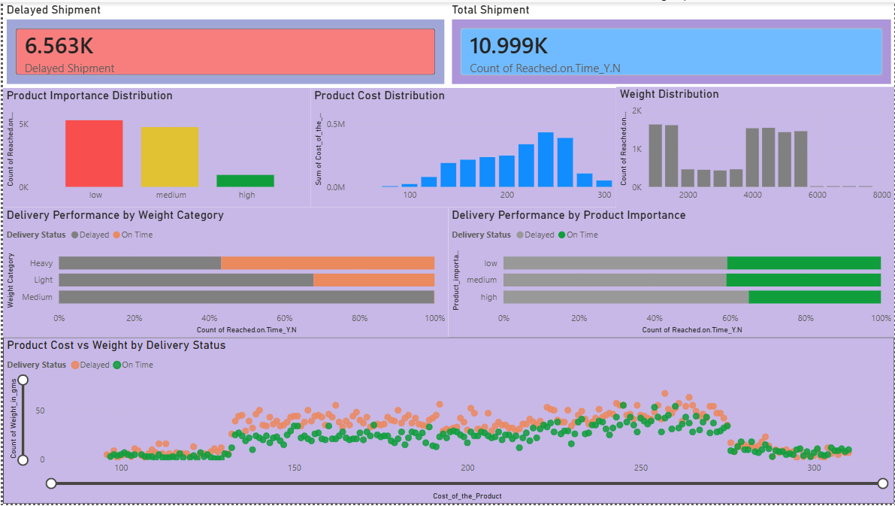
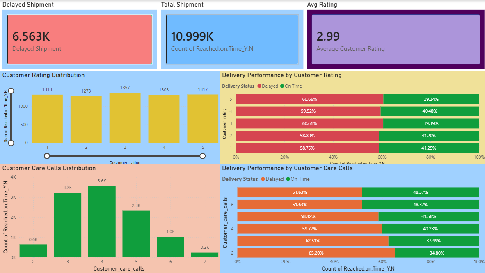

# E-Commerce Shipping Data Analysis

## Project Overview

This project analyzes e-commerce shipping data to identify factors that influence delivery performance and shipment delays. The analysis was conducted using Python for Exploratory Data Analysis (EDA) and Power BI for dashboard visualization.

## Objectives

* Analyze shipment delivery performance.
* Identify factors contributing to delayed deliveries.
* Evaluate the impact of product characteristics on delivery status.
* Explore customer behavior and shipping methods.
* Build an interactive Power BI dashboard for business insights.

---

## Tools & Technologies

* Python
* Pandas
* NumPy
* Matplotlib
* Seaborn
* Plotly
* Missingno
* Power BI

---

## Repository Structure

```text
ecommerce-shipping-data-analysis/
│
├── data/
│   └── Train_Data.csv
│
├── images/
│   ├── discount.png
│   └── product.png
│
├── notebook/
│   └── eda-e-commerce-shipping-data.ipynb
│
├── PowerBI/
│   └── EDC.pbix
│
├── requirements.txt
│
└── README.md
```

---

## Dataset

The dataset contains information related to:

* Warehouse location
* Shipping mode
* Customer rating
* Product importance
* Product cost
* Discount offered
* Product weight
* Delivery status

Target Variable:

* `Reached.on.Time_Y.N`

  * 0 = On Time
  * 1 = Delayed

---

## Exploratory Data Analysis

The notebook includes:

* Data Cleaning
* Missing Value Analysis
* Correlation Analysis
* Customer Analysis
* Shipping Analysis
* Product Analysis
* Discount Analysis

Notebook:

```text
notebook/eda-e-commerce-shipping-data.ipynb
```

---

## Power BI Dashboard

The dashboard consists of several analysis pages:

### Product Analysis Dashboard



### Discount & Customer Loyalty Analysis



---

## Key Business Questions

1. Which warehouse handles the highest shipment volume?
2. Which shipping method experiences the highest delay rate?
3. Does customer behavior affect delivery performance?
4. Do product weight and product importance influence delays?
5. Does discount offered impact shipment performance?

---

## Files

### Dataset

```text
data/Train_Data.csv
```

### Notebook

```text
notebook/eda-e-commerce-shipping-data.ipynb
```

### Power BI Dashboard

```text
PowerBI/EDC.pbix
```

---

## Author

**Ilyas Yasin Nurulah**

Information Systems Student

Interested in:

* Data Analysis
* Business Intelligence
* Backend Development
* Information System Design
